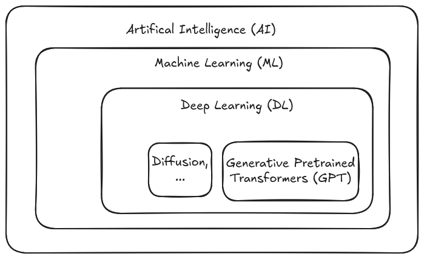
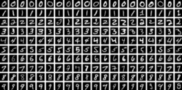

# Hello, World!

> Martin Czygan, SWE, DE

* AG Index
* Archivierung von wissenschaftlicher Kommunikation
* Digitale Aufbewahrung, LZA
* Autor (Python, ML)

# Intro

* Überblick
* Anwendungsgebiete
* Prototypen
* Probleme

# Hinweis

* Generative KI ist experiementell und im Vergleich zu anderer Software weniger
  steuerbar (probabilistisch); Für alles was exakte Daten und Transaktionen
benötigt, ist es zunächst nicht geeignet.

# AI, ML, DL, GPT, ...

{height=200px width=280px}

# Anwendungsgebiete

* OCR (docling)
* RAG (support)
* Recommendation (embeddings)
* Bildverstehen und Suche (CLIP)
* Code (deepseek, mistral)
* MCP (model-context-protocol)

# OCR

* Optical Character Recognition
* Anfänge des Maschinellen Lernens: [MNIST](https://en.wikipedia.org/wiki/MNIST_database)

# Bildverstehen

# Code

# Model-Context-Protocol

# ...
