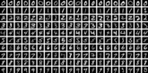

# Hello, World!

> Martin Czygan, SWE, DE

* AG Index, BDD, [UBL](https://ub.uni-leipzig.de)
* [Archivierung von wissenschaftlicher Kommunikation](https://scholar.archive.org)
* [Digitale Aufbewahrung](https://webservices.archive.org/pages/vault/), LZA
* [Autor](https://scholar.google.de/citations?user=7gueY4EAAAAJ&hl=de) (Python, ML), [Open Source](https:/github.com/miku), [...](https://golangleipzig.space)

# Intro

* Projekte
* Prototypen
* Probleme

# Hinweis

* Generative KI ist experimentell und im Vergleich zu klassischer Software
  weniger steuerbar (probabilistisch); Für alles was exakte Daten und
Transaktionen benötigt, ist es zunächst nicht geeignet.

> The more it [the AI model] reasons, the more unpredictable it becomes. --
> Ilya Sutskever, [NeurIPS
> 2024](https://youtu.be/1yvBqasHLZs?si=g5LmpHX7lPbjtH8U&t=869)

# AI, ML, DL, GPT, ...

{height=200px width=280px}

Difference AI/ML: [ai.stackexchange.com/q/35/28](https://ai.stackexchange.com/q/35/28)

# Was andere sagen

Einsatz von [GENAI in Unternehmen](https://www.bitkom.org/sites/main/files/2024-02/Bitkom-Leitfaden-Generative-KI-im-Unternehmen.pdf) (BITKOM, 2025):

* **Text**: Content, Übersetzung, Marketing, Support, Berichtswesen, Texterstellung und Zusammenfassung, FAQ, Forschung, Literaturrecherche
* **Bild**: Prototypen für Webseiten, Bildbearbeitung, Spieleentwicklung, Retail, AR, 3D-Druck, Geodaten
* **Audio**: Sprachausgabe, Musik, Hörbuch, Sounddesign, Transkription, Podcast, Sprachkurse

# Persönliche Perspektive

* AI Kurs 2011:
  [www.ai-class.com](http://web.archive.org/web/20110901100247/http://www.ai-class.com/),
[Software](https://github.com/miku),
[Veröffentlichungen](https://scholar.google.de/citations?user=7gueY4EAAAAJ&hl=de),
[Talks](https://github.com/miku/workshops)
* AI hierarchy of needs, e.g.
  [DAAIS_FACTSHEET.PDF](https://media.defense.gov/2023/Nov/02/2003333301/-1/-1/1/DAAIS_FACTSHEET.PDF#page=2)

# Projekte

* OCR (docling), HTR
* RAG (support)
* Recommendation (embeddings)
* Bildverstehen und Suche (CLIP)
* Code (deepseek, mistral)
* MCP (model-context-protocol)

# OCR

Klassisches Maschinelles Lernens: [MNIST](https://en.wikipedia.org/wiki/MNIST_database) (1988)

<!-- If at any point Machine Learning seems confusing [...] it’s really just curve
fitting. -- [J. Kaplan, Notes on Contemporary Machine Learning for Physicists,
2019](https://sites.krieger.jhu.edu/jared-kaplan/files/2019/04/ContemporaryMLforPhysicists.pdf) -->

# OCR (docling)

* Optical Character Recognition (OCR), Handwritten Text Recognition (HTR)
* Diverse quelloffene Software, z.B. [Docling](https://arxiv.org/pdf/2408.09869)

> This technical report introduces Docling, an easy to use, self-contained, MIT-
licensed open-source package for PDF document conversion. It is powered by
state-of-the-art specialized AI models for layout analysis (DocLayNet) and table
structure recognition (TableFormer), and runs efficiently on commodity hardware
in a small resource budget

# Docling

# Bildverstehen

# Code

# Model-Context-Protocol

# Probleme

* Literaturrecherche
